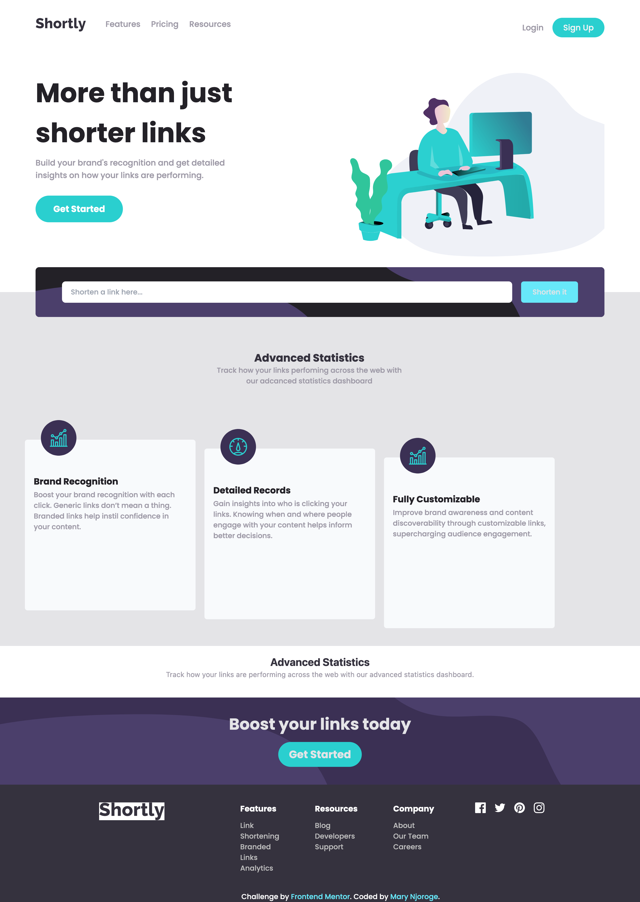

# URL-shortening-Api

A frontend mentor challenge.

## Recommended IDE Setup

[VSCode](https://code.visualstudio.com/) + [Volar](https://marketplace.visualstudio.com/items?itemName=johnsoncodehk.volar) (and disable Vetur) + [TypeScript Vue Plugin (Volar)](https://marketplace.visualstudio.com/items?itemName=johnsoncodehk.vscode-typescript-vue-plugin).

## Customize configuration

See [Vite Configuration Reference](https://vitejs.dev/config/).

## Project Setup

```sh
npm install
```

### Compile and Hot-Reload for Development

```sh
npm run dev
```

### Compile and Minify for Production

```sh
npm run build
```
### Screenshots



### Links

- Solution URL: [Solution URL here](https://github.com/Maryahcee/URL-shortening-Api)
- Solution URL: [Solution URL here](https://url-shortening-api-challenge.netlify.app/)
## My process

-Install Vue CLI
-create components as per card using mobile first approach
-Used Tailwind Css to style my card
-hosted the site using netlify
### Built with

- Semantic HTML5 markup
- Tailwind CSS
- Flexbox
- Mobile-first workflow
- [Vuejs](https://vuejs.org/) - Vuejs framework
- [Styled Components](https://styled-components.com/) - For styles
## Author
